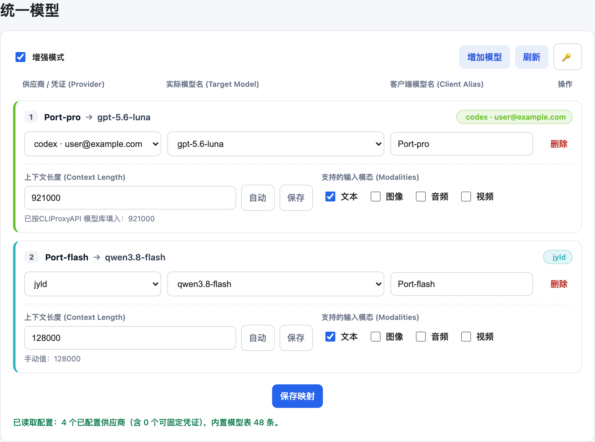
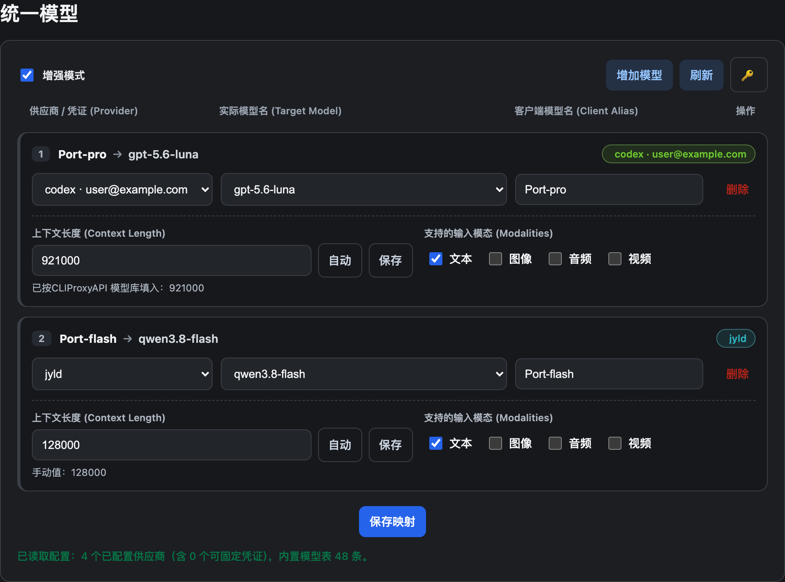
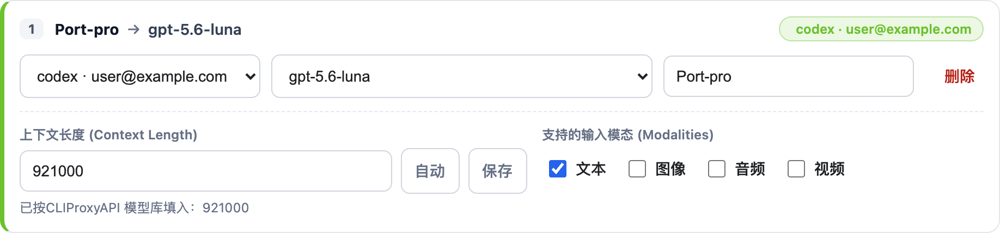

# Unified Model for CLIProxyAPI

[English](README.md) · [简体中文](README_CN.md)

**Give every client one stable model name — and hide everything else.**

A drop-in [CLIProxyAPI](https://github.com/router-for-me/CLIProxyAPI) plugin that turns the messy native catalog (`gpt-5.6-luna`, `qwen3.8-flash`, `claude-sonnet-4`, …) into the aliases *you* choose. Clients always see `Port-pro`. You decide which credential, which upstream model, and which context window sit behind it.

[](https://github.com/Mu-scorpio/cpa-unified-model-plugin/releases/latest)
[](LICENSE)
[](https://github.com/router-for-me/CLIProxyAPI)
[](https://go.dev/)

<p align="center">
  
</p>

<p align="center"><em>Management page · light theme. Provider-colored cards, live credential dropdown, one-click enhanced mode.</em></p>

<p align="center">
  
</p>

<p align="center"><em>Same page · dark theme.</em></p>

---

## Why this plugin

CLIProxyAPI already speaks OpenAI, Claude, Gemini, Codex and Grok. What it does *not* give you is a stable name that survives provider reshuffles, model-id churn, or a client that hard-codes `gpt-4o`.

| Without Unified Model | With Unified Model |
| --- | --- |
| Clients see 40+ native models | Clients see `Port-pro`, `Port-flash`, … |
| A Codex outage means rewriting every client | Flip the alias target, clients keep calling `Port-pro` |
| Round-robin across every Codex login | Pin an alias to one account |
| `/v1/models` leaks every upstream name | **Enhanced mode** hides natives; only aliases remain |

No patches to CLIProxyAPI. The plugin talks only the public plugin ABI.

---

## Highlights

<p align="center">
  
</p>

**Enhanced mode** — one checkbox. OpenAI `/v1/models`, Anthropic `/v1/models`, Gemini listings, Codex client catalogs and Grok Shell all shrink to the aliases you configured. Native models stay registered for *routing*, they just stop being advertised.

<p align="center">
  
</p>

**Per-alias cards**

- **Provider / credential** — built from what is actually logged in. OAuth accounts, API keys, OpenAI-compatible providers. Unconfigured providers never appear.
- **Pin a credential** — pick `codex · user@example.com` and only that login serves the alias. Pick the aggregate `codex（全部凭证）` and CPA keeps native round-robin.
- **Context length** — auto-filled from a built-in table (GPT / Claude / Gemini / Grok / Kimi / DeepSeek / GLM, …), overridable per alias or written back into the shared table.
- **Modalities** — advertise `text` / `image` / `audio` / `video` independently of routing.
- **Thinking suffixes** — `Port-pro(high)` still matches `Port-pro` and is forwarded as `gpt-5.6-luna(high)`.

---

## Install

### 1. Drop in a prebuilt binary (fastest)

Download the asset that matches the CPA host from the [latest release](https://github.com/Mu-scorpio/cpa-unified-model-plugin/releases/latest) and place it next to your other plugins:

```text
<CPA>/plugins/<GOOS>/<GOARCH>/unified-model-v0.4.1.<so|dylib|dll>
```

| Host | Asset |
| --- | --- |
| macOS Apple Silicon | `unified-model-v0.4.1-darwin-arm64.dylib` |

The **versioned** file name is required: CPA's plugin host hot-reloads `unified-model-vX.Y.Z.*` over older builds. A bare `unified-model.dylib` loses to any versioned neighbour.

### 2. Build from source

Clone this repo **next to** a CLIProxyAPI checkout (the `go.mod` `replace` points at `../../CPA`):

```text
Projects/
├── CPA/                          # github.com/router-for-me/CLIProxyAPI
└── cpa-unified-model-plugin/     # this repository
```

```bash
./build.sh
```

`build.sh` compiles a versioned shared library into `bin/<GOOS>/<GOARCH>/` and, when `../CPA` (or `$CPA_DIR`) exists, copies it into CPA's plugin directory so a running instance hot-reloads it.

Manual build:

```bash
cd go
CGO_ENABLED=1 go build -buildmode=c-shared \
  -o ../bin/$(go env GOOS)/$(go env GOARCH)/unified-model-v0.4.1.dylib .
```

Requires **Go 1.26+**, CGO, and a CPA tree recent enough to expose the stock plugin ABI (CLIProxyAPI **v7.3.9+**).

### 3. Enable it

```yaml
plugins:
  enabled: true
  dir: "plugins"
  configs:
    unified-model:
      enabled: true
      priority: 100
      enhanced-mode: true          # optional: hide native models from clients
      mappings:
        - name: Port-pro
          target: gpt-5.6-luna
          provider: codex
          # auth pins the alias to one credential (auth file name)
          # auth: codex-user@example.com.json
          modalities: [text]
        - name: Port-flash
          target: qwen3.8-flash
          provider: openai-compatible-jyld
          modalities: [text]
```

Open **统一模型** from the plugin resource menu in Management Center. Saving a mapping takes effect immediately; the enhanced-mode checkbox writes on toggle.

The page authenticates with CPA's management key through the 🔑 panel when the host requires one.

---

## Configuration reference

| Field | Type | Default | Meaning |
| --- | --- | --- | --- |
| `enhanced-mode` | bool | `false` | Hide native CPA models from every client-facing catalog. |
| `mappings[].name` | string | `Port` | Client-facing alias. Case-insensitive; keeps thinking suffixes such as `Port(high)`. |
| `mappings[].target` | string | `gpt-5.5` | Real model the alias is routed to. |
| `mappings[].provider` | string | empty | Built-in / OpenAI-compatible provider key. Empty keeps the provider-agnostic host-callback fallback. |
| `mappings[].auth` | string | empty | Credential ID (auth file name). Requires `provider`. Empty = native round-robin. |
| `mappings[].context-length` | int | auto | Advertised context window. `0` / omitted → built-in table, then `128000`. Clamped to `100000000`. |
| `mappings[].modalities` | list | `[text]` | Advertised input modalities: `text`, `image`, `audio`, `video`. |
| `context-lengths` | map | — | Shared model-name → context-window table that overrides the built-in catalog. |

```yaml
context-lengths:
  gpt-5.5: 300000         # replace a built-in entry
  qwen3.8-flash: 262144   # add a model the built-in table does not know
```

Matching ignores case, `-` / `.` / `_`, provider prefixes (`openai/gpt-5.5`) and thinking suffixes. The longest prefix wins, so `gpt-5.6` covers `gpt-5.6-sol` unless a more specific entry exists.

`context-length` and `modalities` are **metadata only**. They change what `/v1/models` (and Claude / Gemini / Codex-client listings) advertise; they never rewrite the upstream request.

---

## How routing works

```text
Client  ──Port-pro──►  Unified Model
                          │
          unpinned        │        pinned (auth set)
          ┌───────────────┴───────────────┐
          ▼                               ▼
   native CPA router              plugin executor
   (OAuth, translation,           host.model.execute
    usage stay in-process)        ForcedProvider + AuthID
          │                               │
          └────────── target model ───────┘
```

- **Unpinned** aliases (`provider` set, `auth` empty) are a direct model-router decision. CPA keeps its native OAuth, protocol translation and usage path; only the request model is rewritten. No nested plugin execution, no second upstream hop.
- **Pinned** aliases (`auth` set) go through the plugin executor and call `host.model.execute` with `forced_provider` + `auth_id`, so only that credential is used.
- **Enhanced mode** filters the listing *response*. Execution is unchanged: an alias can still target `gpt-5.6-luna` after that name has disappeared from `/v1/models`.

Covered listings when enhanced mode is on:

- OpenAI `/v1/models` (`data`)
- Anthropic `/v1/models` (`data`, including cloaked `claude-fable-5-dd-…` IDs)
- Gemini model lists (`models` / `models/<name>`)
- Codex client catalogs (`models` / `slug`)
- Grok Shell lists (`data`)

---

## Portability

The plugin is fully self-contained. It integrates only through public, upstream surfaces — **no CLIProxyAPI core modifications**:

- Plugin ABI: model registrar, model router, executor, request interceptor, response interceptor, management API.
- Pinned credentials use stock `host.model.execute` fields `forced_provider` and `auth_id`.
- Enhanced mode uses stock `response.intercept_after` on CPA's model-list writer.
- Management page talks to `/v0/management/config`, `/v0/management/auth-files`, `/v0/management/auth-files/models`, `/v0/management/model-definitions/:channel`, and `/v0/management/plugins/unified-model/config`.

Build `GOOS` / `GOARCH` must match the CPA server. The resource page saves through the Management API and therefore needs a valid management key on a stock host.

---

## Compatibility

| | |
| --- | --- |
| CLIProxyAPI | v7.3.9+ (stock plugin ABI) |
| Go (from source) | 1.26+ with CGO |
| Clients | Any OpenAI / Claude / Gemini / Codex / Grok client that reads the model list |

---

## License

[MIT](LICENSE)
